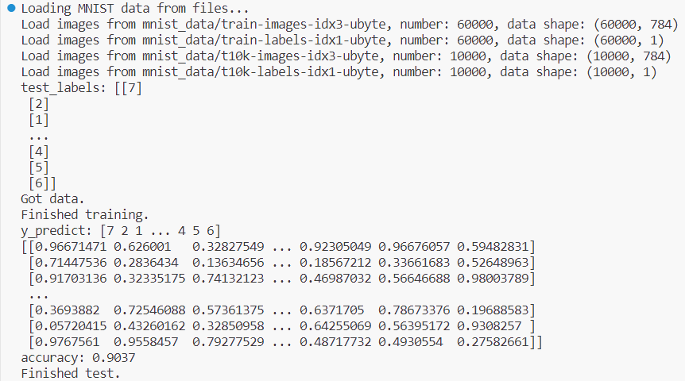
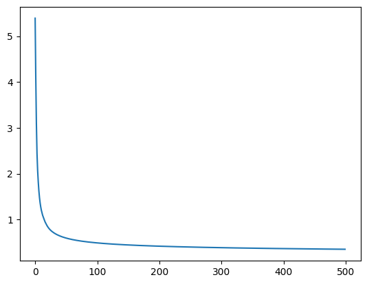

# 机器学习实验报告

<center>Lab1 Softmax_regression</center>

<center>网络空间安全学院 物联网工程</center>

<center>2110951 梁晓储</center>


## 实验要求

在本次实验中，需要训练⼀个分类器来完成对MNIST数据集中 0-9 10个手写数字的分类


初始代码文件为

> data_process.py
>
> evaluate.py
>
> main.py
>
> softmax_regression.py
>
> train.py


MNIST数据集可在[数据集下载地址](http://yann.lecun.com/exdb/mnist/)中下载，共有4个.gz文件，解压后放在初始代码的 ex1/ 目录下

> t10k-images-idx3-ubyte
>
> t10k-labels-idx1-ubyte
>
> train-images-idx3-ubyte
>
> train-labels-idx1-ubyte


初始代码中已经包含以下内容：
•  加载训练和测试数据集
•  训练和测试主体代码
•  在  train()  函数中调用  softmax_regression() 函数和  cost() 函数

当训练完成，分类器会输出10个类别的测试准确率。
我的任务是在 softmax_regression.py 文件中实现 softmax 目标函数 ，计算损失值 J (θ, x, y)，将它存储在变量f 中，并计算梯度∇θ J (θ, x, y)，将它存储在变量 g 中。初始代码会将 θ 的形状定义为⼀个 k×n 的矩阵  (K=10个类别)。此外，我需要完成函数 cal_accuracy()，输出分类器在测试集上的准确率。


## 实验内容

### Softmax_regression()

```python
def softmax_regression(theta, x, y, iters, alpha):
    loss_history = []
    for i in range(iters):
        score = np.dot(theta, x.T)  # 计算得分
        score -= np.max(score, axis=0)  # 减去最大值，避免数值上溢
        exp_score = np.exp(score)  # 指数化得分
        probabilities = exp_score / np.sum(exp_score, axis=0)  # 计算概率
        loss = -np.sum(y * np.log(probabilities)) / x.shape[0]  # 计算损失
        loss_history.append(loss)
        gradient = np.dot(probabilities - y, x) / x.shape[0]  # 计算梯度
        theta -= alpha * gradient  # 更新theta参数
    # 绘制损失曲线
    plt.plot(loss_history)
    return theta
```

---

#### Input:

 - theta：参数矩阵，k*n矩阵，初始化为随机赋值且每行和为1
 - x：输入数据的特征矩阵，m*n矩阵
 - y：独热编码后的真实标签
 - iters：训练轮数
 - alpha：学习率

---

#### Output:

 plt.plot(loss_historys)：绘制损失曲线

 theta ：参数向量

---

#### 计算损失值

1. 首先，对于给定的参数 `theta`、输入特征 `x` 和标签 `y`，通过矩阵乘法计算得分 `score`。我使用了 `np.dot(theta, x.T)` 来实现矩阵乘法，得到的 `score` 是一个包含每个类别的得分值的矩阵
2. 为了避免数值上溢，代码中减去了得分矩阵中的最大值，即 `score -= np.max(score, axis=0)`
3. 接下来，将得分矩阵进行指数化处理，得到指数化的得分 `exp_score`
4. 然后，计算每个类别的概率 `probabilities`，即将指数化的得分除以其总和
5. 通过计算交叉熵损失，即 `-np.sum(y * np.log(probabilities)) / x.shape[0]`，来衡量预测概率与真实标签之间的差异
6. 将每次迭代的损失值记录在 `loss_history` 列表中
7. 计算梯度，即 `np.dot(probabilities - y, x) / x.shape[0]`，表示预测概率与真实标签的差异加权平均值，用于更新参数 `theta`
8. 使用梯度下降法更新参数 `theta`，即 `theta -= alpha * gradient`
9. 最后，将损失值的变化绘制成损失曲线，并返回更新后的 `theta` 参数

---

#### 计算梯度

计算梯度的过程可以用以下公式表示：`np.dot(probabilities - y, x) / x.shape[0]`

1. 首先，得到了每个类别的预测概率向量 `probabilities`，其中每个元素表示该样本属于该类别的概率
2. 根据softmax回归的定义，我们知道该模型的预测概率与真实标签之间的差异可以通过 `probabilities - y` 来表示
3. 对于每个样本，我们需要将其特征向量 `x` 乘以 `probabilities - y`，然后对所有样本取平均值。这相当于将每个样本的特征向量乘以其对应的误差，然后对所有样本求平均。这一步骤通过 `np.dot(probabilities - y, x)` 来实现
4. 最后，除以样本数量 `x.shape[0]`，得到梯度向量 `gradient`


### Cal_accuracy()

```python
def cal_accuracy(y_pred, y):
    acc = (
        np.sum(
            np.equal(
                y_pred,
                y.reshape(
                    -1,
                ),
            )
        )
        / y.shape[0]
    )
    return acc
```

函数输入参数包括预测标签 `y_pred` 和真实标签 `y`

具体来说，函数首先将 `y` 的形状调整为一维向量，使用 `y.reshape(-1,)` 实现。然后，通过 `np.equal(y_pred, y.reshape(-1,))` 计算预测标签与真实标签相等的个数，并将结果进行求和，得到预测正确的样本数量

最后，通过除以总样本数 `y.shape[0]` 得到分类模型的准确率，即正确预测的样本数占总样本数的比例。然后返回计算得到的准确率值


## 实验结果



损失曲线如下


